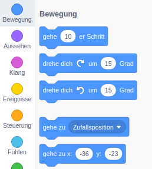
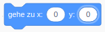
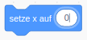
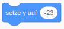

Führe die folgenden Schritte aus, um die Koordinaten einer Figur so festzulegen, dass es an einer bestimmten Stelle auf der Bühne angezeigt wird.

- Klicke in der **Palette** auf **Bewegung**.
    
    

- Suche den Block `gehe zu x: () y: ()`.
    
    

- Gib die `x` Position und die `y` Position ein, an die deine Figur gehen soll.
    
    

- Füge den `gehe zu` Block deinem Programm hinzu, z.B.
    
    

- Wenn du nur die Position `x` oder `y` einstellen möchtest, kannst du stattdessen einen der beiden folgenden Blöcke verwenden.
    
     