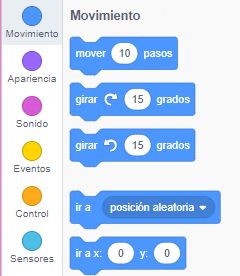
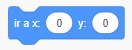
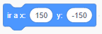
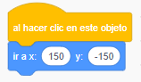
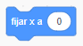
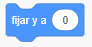

Para establecer la coordenada de un objeto con el objetivo que aparezca en una parte específica de Stage, siga los siguientes pasos.

- Haga clic en el menú **Motion** en la paleta **Code**.
    
    

- Encuentra el bloque ` ve a x: ( ) y: ( )`.
    
    

- Escribe la posición `x` y la posición `y` donde quiera que vaya su objeto animado.
    
    

- Adjunta tu bloque `ve a ` a tu programa, por ejemplo.
    
    

- Si solo quieres establecer la posición `x` o la posición `y`, puedes usar cualquiera de los dos bloques siguientes en su lugar.
    
     