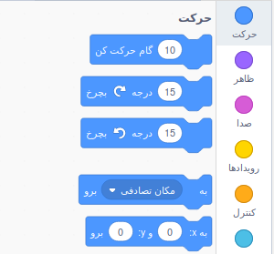
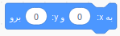
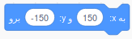
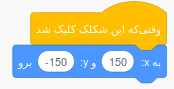
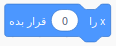
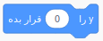

برای تنظیم مختصات شکلک به طوری که در یک مکان مشخص در صفحه نشان داده شود، مراحل زیر را دنبال کنید.

- بر روی منوی **Motion** در پالت **Code** کلیک کنید.
    
    

- بلوک `به x:() و y:() برو` را پیدا کنید.
    
    

- موقعیت `x` و `y` را که می خواهید شکلک به آنجا برود، وارد کنید.
    
    

- Attach your `go to` block to your program e.g.
    
    

- If you only want to set the `x` or `y` position, you can use either of the following two blocks instead.
    
     