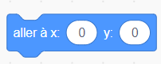
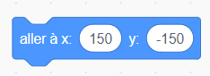
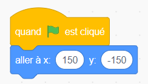
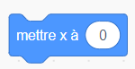
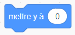

Pour définir les coordonnées d'un sprite afin qu'il apparaisse à un certain endroit sur la scène, suis les étapes ci-dessous.

- Clique sur le menu **Mouvement** dans la palette **Code**.
    
    

- Trouve le bloc `aller à x: ( ) y: ( )`.
    
    

- Type in the `x` position and `y` position that you want your sprite to go to.
    
    

- Attach your `go to` block to your program e.g.
    
    

- Si tu veux seulement définir la position `x` ou `y` , tu peux utiliser l'un des deux blocs suivants à la place.
    
     