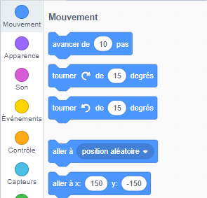

Pour définir les coordonnées d'un sprite afin qu'il apparaisse à un certain endroit sur la scène, suis les étapes ci-dessous.

- Clique sur le menu **Mouvement** dans la palette **Code**.
    
    

- Trouve le bloc `aller à x: ( ) y: ( )`.
    
    

- Tape la position `x` et la position `y` auxquelles tu souhaites que ton sprite se déplace.
    
    

- Attache ton bloc `aller à` à ton programme, par exemple.
    
    

- Si tu veux seulement définir la position `x` ou `y` , tu peux utiliser l'un des deux blocs suivants à la place.
    
     