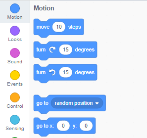

स्प्राइट के निर्देशांक को इस तरह सेट करने के लिए कि यह स्टेज पर एक निश्चित स्थान पर दिखाई दे, नीचे दिए गए चरणों का पालन करें।

- **कोड (Code)** पैलेट में **मोशन (Motion)** मेनू पर क्लिक करें।
    
    

- `go to x: ( ) y: ( )` ब्लॉक ढूँढें।
    
    

- उस `x` स्थिति और `y` स्थिति को टाइप करें जिस पर आप चाहते हैं कि आपका स्प्राइट जाए।
    
    

- अपने `go to` ब्लॉक को अपने प्रोग्राम के साथ संलग्न करें, उदाहरण के लिए
    
    

- यदि आप केवल `x` या `y` स्थिति सेट करना चाहते हैं, तो आप इसके बजाय निम्नलिखित दो ब्लॉकों में से किसी एक का उपयोग कर सकते हैं।
    
     