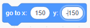

स्प्राइट के निर्देशांक को इस तरह सेट करने के लिए कि यह स्टेज पर एक निश्चित स्थान पर दिखाई दे, नीचे दिए गए चरणों का पालन करें।

- **कोड (Code)** पैलेट में **मोशन (Motion)** मेनू पर क्लिक करें।
    
    

- Find the `go to x: ( ) y: ( )` block.
    
    

- Type in the `x` position and `y` position that you want your sprite to go to.
    
    

- Attach your `go to` block to your program e.g.
    
    

- If you only want to set the `x` or `y` position, you can use either of the following two blocks instead.
    
     