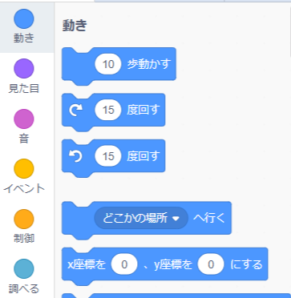

ストライプの座標を設定して、ステージ上の特定の位置に表示させるには、次のようにします。

- **コード** パレットの **動き** メニューをクリックします。
    
    

- `x座標を( )、 y座標を( )にする`ブロックを探します。
    
    

- スプライトを移動させたい`x`の位置と、 `y`の位置を入力します。
    
    

- `(どこかの場所)へ行く`ブロックをプログラムに取り付けます。例:
    
    

- もし、 `x` か `y`のどちらかだけを設定したい場合は、代わりに次の2つのブロックを使うこともできます。
    
    
    