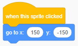

स्प्रिटेचे समन्वय सेट करण्यासाठी जेणेकरून स्टेजवरील एका विशिष्ट ठिकाणी हे दिसून येईल, खाली चरणांचे अनुसरण करा.

- **Code(कोड)** पॅलेट मधील **Motion(मोशन)** मेनूवर क्लिक करा.
    
    

- `go to x: () y: ()` ब्लॉकवर जा.
    
    

- `x` पोजीशन आणि `y` पोजीशन टाइप करा जिथे आपल्याला आपले स्प्राइट उभे करायचे आहे.
    
    

- आपल्या प्रोग्राम मध्ये `go to` ब्लॉक संलग्न करा उदा.
    
    

- आपण केवळ `x` किंवा `y` पोजीशन सेट करू इच्छित असल्यास, आपण त्याऐवजी खालीलपैकी दोन ब्लॉक्स वापरू शकता.
    
     