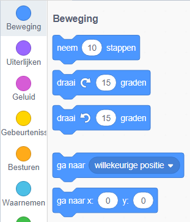
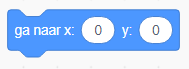
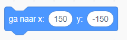
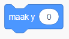

Om de coördinaten van een sprite zo in te stellen dat deze op een bepaalde locatie in het speelveld verschijnt, volg je de onderstaande stappen.

- Klik op het menu **Beweging** in het tabblad **Code**.
    
    

- Zoek het `ga naar x: ( ) y: ( )` blok.
    
    

- Typ in de `x` positie en de `y` positie waar je jouw sprite naartoe wilt laten gaan.
    
    

- Voeg je `ga naar` blok toe aan je programma, bijv.
    
    

- Als je alleen de positie `x` of `y` in wilt stellen, kunt je in plaats daarvan één van de volgende twee blokken gebruiken.
    
     