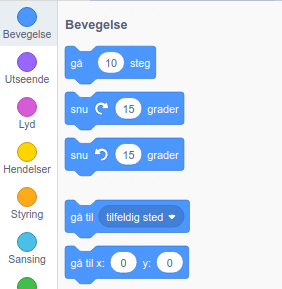
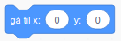
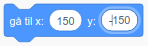
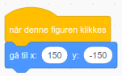
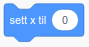
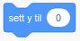

Følg trinnene nedenfor for å angi koordinatene til en figur, slik at den vises på et bestemt sted på scenen.

- Klikk på **Bevegelse** menyen i **Kode** arkfanen.
    
    

- Finn blokken med `gå til x: ( ) y: ( )`.
    
    

- Skriv inn `x` posisjonen og `y` posisjonen som du vil at figuren din skal gå til.
    
    

- Fest `gå til` blokken til programmet ditt, f.eks.
    
    

- Hvis du bare vil angi `x` eller `y` posisjonen, kan du bruke en av følgende to blokker i stedet.
    
     