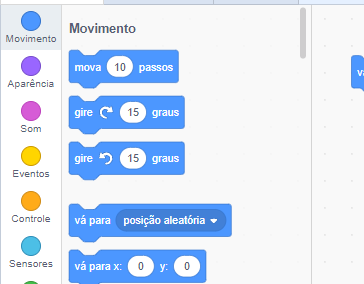
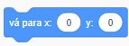
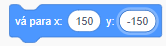
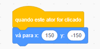
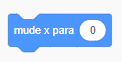
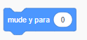

To set a sprite's coordinates so that it appears at a certain location on the Stage, follow the steps below.

- Click on the **Motion** menu in the **Code** palette.
    
    

- Find the `go to x: ( ) y: ( )` block.
    
    

- Type in the `x` position and `y` position that you want your sprite to go to.
    
    

- Attach your `go to` block to your program e.g.
    
    

- If you only want to set the `x` or `y` position, you can use either of the following two blocks instead.
    
     