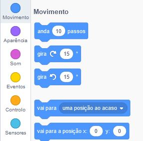
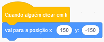

Para definires as coordenadas de um actor de forma a que ele apareça num determinado local no Palco, segue as etapas abaixo.

- Clica no menu **Movimento** na paleta **Código**.
    
    

- Encontra o bloco ` vai para a posição x: () y: () `.
    
    

- Digita a posição `x` e a posição `y` para a qual desejas que o teu actor vá.
    
    

- Anexa o teu bloco ` vai para a posição ` ao teu programa, por exemplo.
    
    

- Se apenas desejas definir a posição `x` ou `y`, podes antes usar qualquer um dos blocos seguintes.
    
     