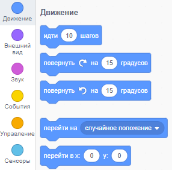
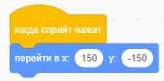
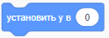

Для задания координат спрайта так, чтобы он появился в центре Сцены, следуй пошаговой инструкции приведенной ниже.

- Нажми на меню **Движение** в вкладке **Код**.
    
    

- Найди блок `перейти в x: ( ) y: ( )`.
    
    

- Введи координаты `х` и `у` куда должен перейти твой спрайт.
    
    

- Добавь этот блок `перейти в` к своей программе.
    
    

- Если ты хочешь только задать `x` или `у` положение, есть другие два блока, приведенные ниже, которые ты можешь использовать.
    
     