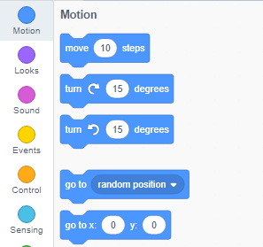
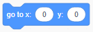

පහත පියවර අනුගමනය කර, වේදිකාවේ එක්තරා ස්ථානයක දිස්වන පරිදි sprite ගේ ඛණ්ඩාංක සැකසීමට ඔබට පුළුවන.

- **කේත(code)** පලතේ(palette එකේ) ඇති **චලිතය(Motion)** මෙනුව මත ක්ලික් කරන්න.
    
    

- `go to x : () y: ()` කට්ටිය(block එක) සොයා ගන්න.
    
    

- ඔබේ sprite එක යැවීමට අවශ්‍ය ස්ථානයේ `x` සහ `y` ඛණ්ඩාංක අගයන් ටයිප් කරන්න.
    
    

- ඔබගේ `go to` කට්ටිය(block එක) ඔබේ වැඩසටහනට අමුණන්න උදා.
    
    

- ඔබට අවශ්‍ය වන්නේ `x` ගේ හෝ `y` ගේ පිහිටීම පමණක් සැකසීමට නම්, ඔබට ඒ සඳහා පහත සඳහන් කොටස් දෙකෙන් එකක් භාවිතා කළ හැකිය.
    
     