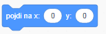
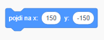
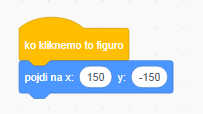
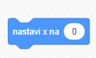
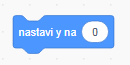

Za določitev koordinat figure, da se ta pojavi na določenem položaju, sledi tem korakom.

- Klikni na meni **Gibanje** na zavihku **koda**.
    
    

- Najdi blok `pojdi na x: () x: ()`.
    
    

- Vnesi položaj `x` in `y`, kamor si želiš, da bo tvoja figura šla.
    
    

- Pripni svoj blok `pojdi na` k svojemu programu ali delu tega.
    
    

- Če si želiš spremeniti le položaj `x` ali le `y`, lahko namesto tega uporabiš ta dva bloka.
    
     