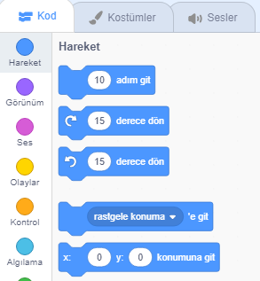
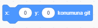
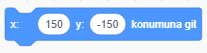
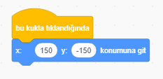
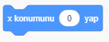
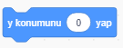

Bir kuklanın Sahne Alanı'ndaki konumunu, belirli bir yerde görünecek şekilde ayarlamak için aşağıdaki adımları izleyin.

- **Kod** sekmesinden **Hareket** menüsünü tıklayın.
    
    

- `x: ( ) y: ( ) konumuna git` bloğunu bulun.
    
    

- Type in the `x` position and `y` position that you want your sprite to go to.
    
    

- Attach your `go to` block to your program e.g.
    
    

- If you only want to set the `x` or `y` position, you can use either of the following two blocks instead.
    
     